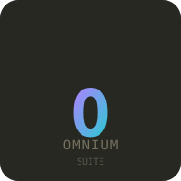
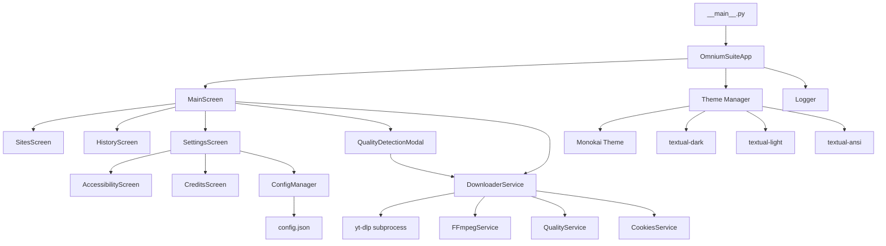
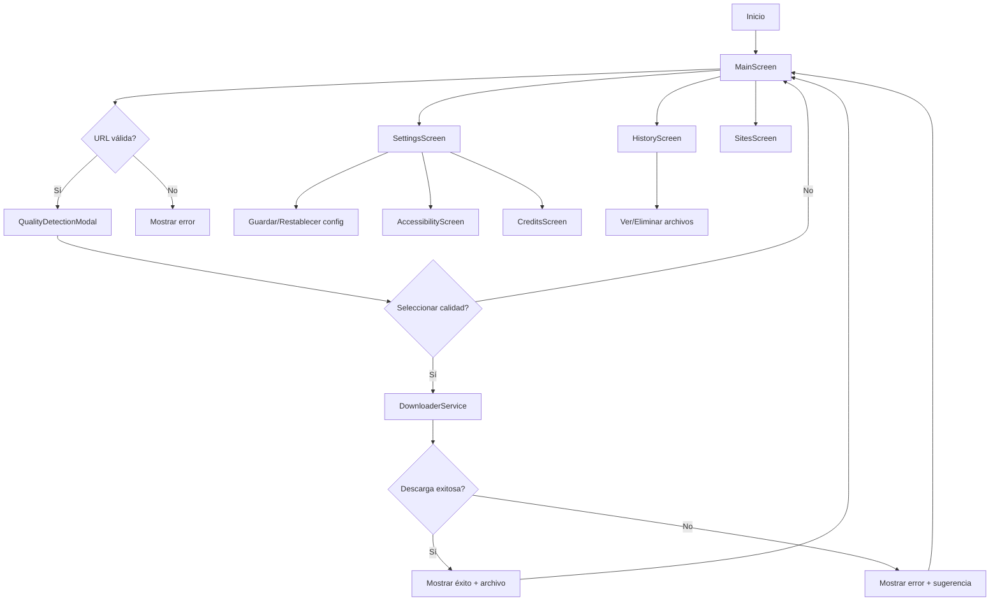
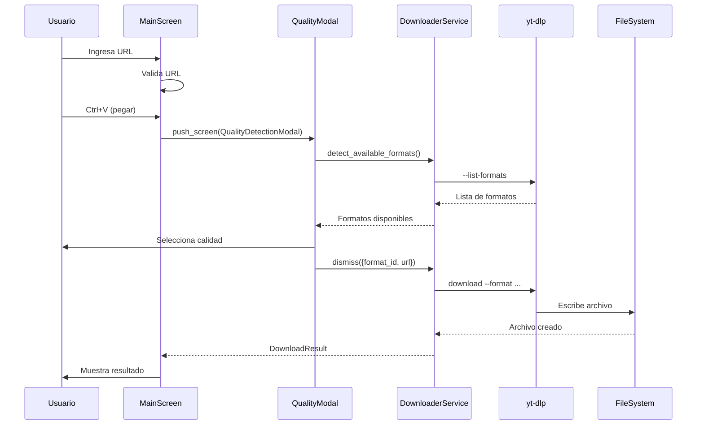

<p align="center">
  
</p>

<h1 align="center">Omnium Suite</h1>
<p align="center">
  <strong>Universal Multimedia Downloader TUI</strong> — Terminal moderna, modular y extensible para descargar video, audio e imágenes de 1000+ sitios.
</p>

<p align="center">
  <a href="https://github.com/probuho/omnium/actions/workflows/ci.yml">
    
  </a>
  <a href="https://github.com/probuho/omnium/releases/latest">
    
  </a>
  <a href="https://github.com/probuho/omnium/blob/main/LICENSE">
    
  </a>
  <a href="https://github.com/probuho/omnium/stargazers">
    
  </a>
  <a href="https://github.com/probuho/omnium/issues">
    
  </a>
  <br/>
  <a href="https://github.com/probuho/omnium/actions/workflows/ci.yml">
    
  </a>
  <a href="https://github.com/probuho/omnium/actions/workflows/ci.yml">
    
  </a>
  <a href="https://github.com/probuho/omnium/actions/workflows/ci.yml">
    
  </a>
  <a href="https://python.org">
    
  </a>
</p>

<p align="center">
  <!--  -->
</p>

---

## ✨ Características

| Categoría | Detalles |
|-----------|----------|
| **Video** | YouTube, Vimeo, Twitch, TikTok, Twitter/X, Instagram, Facebook, Reddit, Pinterest, Dailymotion, Crunchyroll, Netflix*, Hulu*, HBO* y 1000+ más |
| **Audio** | SoundCloud, Bandcamp, Mixcloud, Audiomack, Spotify (podcasts), Apple Music* |
| **Imágenes** | Instagram, Pinterest, Twitter/X, Reddit, Tumblr, Imgur, etc. |
| **Calidad** | 8K → 480p, audio VBR/320/256/192/128 kbps, formatos: MP4, MP3, M4A, OPUS, FLAC, WAV, JPG, PNG, WEBP |
| **Autenticación** | `cookies.txt` para contenido privado/edad-restringido/streaming premium |

> *Requiere `cookies.txt` con sesión válida

---

## 🚀 Instalación

### Opción A: Instalación directa (recomendada)
```bash
pip install git+https://github.com/probuho/omnium.git
```

### Opción B: Desde código fuente
```bash
git clone https://github.com/probuho/omnium.git
cd omnium
pip install -e ".[dev]"
```

### Opción C: Ejecutable standalone (próximamente)
```bash
# pyinstaller --onefile --add-binary "ffmpeg.exe;." src/downloader_tui/__main__.py
```

> **Requisitos:** Python 3.11+, FFmpeg (incluido en el repo), `yt-dlp`, `textual`, `pyperclip`

---

## 🎮 Uso Rápido

```bash
# Lanzar TUI
omnium

# O directamente
python -m downloader_tui
```

### Atajos Principales

| Tecla | Acción |
|-------|--------|
| `Enter` | Descargar |
| `Ctrl+V` | Pegar URL + detectar calidades |
| `Tab` / `Shift+Tab` | Cambiar pestaña (Video/Audio/Imagen) |
| `H` | Historial |
| `S` | Configuración |
| `I` | Sitios compatibles |
| `A` | Accesibilidad (atajos) |
| `C` | Créditos |
| `ESC` | Volver / Salir |
| `Q` | Salir |

---

## ⚙️ Configuración

La configuración se guarda en `config.json` (persistente entre sesiones):

```json
{
  "download_dir": "D:\\Vídeo",
  "cookies_file": "cookies.txt",
  "ffmpeg_dir": ".",
  "theme": "textual-dark",
  "video_quality": "bestvideo+bestaudio/best",
  "audio_format": "m4a",
  "audio_quality": "0",
  "image_format": "jpg"
}
```

### En la TUI (`S` → Configuración):
- ✏️ Editar rutas de descargas, cookies, FFmpeg
- 🎨 Cambiar tema (Oscuro/Claro/Sistema)
- 💾 Guardar / 🔄 Restablecer defaults
- 🔍 Verificar cookies / 📁 Abrir carpeta / 🧪 Probar FFmpeg
- ♿ Accesibilidad (A) / 📜 Créditos (C)

---

## 📸 Capturas

### Pantalla Principal
```
  ██████╗ ██████╗ ███╗   ███╗██████╗ ██╗     ██████╗  ██████╗ ████████╗███████╗
 ██╔════╝██═══██╗████╗ ████║██══██╗██║     ██═══██╗██═══██╗╚══██══╝██════╝
 ██║     ██║   ██║██╔████╔██║██████╔╝ ██║     ██║  ██║██║   ██║   ██║   ███████╗
 ██║     ██═══██══╝██══════╝╚══════╝╚══════╝╚══════╝╚══════╝    ╚══════╝╚══════╝

═══════════════════════════════════════════════════════════════════════════════

URL:
> https://youtube.com/watch?v=...  •  pegar con Ctrl+V
✓ URL válida

Video  Audio  Imagen

Calidad y formato se configuran en Config (S)

Descargar (Enter)  Limpiar (Ctrl+L)  Pegar (Ctrl+V)  Sitios (I)  Historial (H)  Config (S)

🔒 Privacidad: Esta herramienta se ejecuta 100% en tu equipo...
```

### Modal de Calidades (Ctrl+V en URL válida)
```
┌──────────────────── Calidades Disponibles ────────────────────┐
│ URL: https://youtube.com/watch?v=...                          │
│ ✅ Se detectaron 12 formatos                                   │
│ ┌────────────────────────────────────────────────────────────┐ │
│ │ 1. ID: 137  Ext: mp4  Res: 1920x1080  (video only)        │ │
│ │ 2. ID: 248  Ext: webm  Res: 1920x1080  (video only)       │ │
│ │ 3. ID: 140  Ext: m4a  Res: audio only  (audio only)       │ │
│ └────────────────────────────────────────────────────────────┘ │
│ [Descargar] [Cancelar]                                         │
└────────────────────────────────────────────────────────────────┘
```

### Configuración
```
┌─────────────────── Configuración ────────────────────┐
│ Carpeta de descargas:                                 │
│ [ D:\Vídeo                                    ]       │
│ Archivo de cookies:                                   │
│ [ cookies.txt                               ]        │
│ Directorio FFmpeg:                                    │
│ [ .                                               ]    │
│ Tema:                                                 │
│ ▸ Oscuro (textual-dark)                               │
│   Claro (textual-light)                               │
│   Sistema (textual-ansi)                              │
│                                                       │
│ [ Guardar ] [ Restablecer ]                           │
│                                                       │
│ [ Verificar cookies ] [ Abrir carpeta ] [ Probar FFmpeg ]│
│ [ Accesibilidad (A) ] [ Creditos (C) ]               │
│                                                       │
│ ESC: Volver  |  A: Accesibilidad  |  C: Creditos      │
└────────────────────────────────────────────────────────┘
```

---

## 🔧 Desarrollo

```bash
# Instalar dependencias de desarrollo
pip install -e ".[dev]"

# Verificación completa
make check        # lint + typecheck + test

# Formateo
make fmt

# Tests
make test

# Type checking
make typecheck

# Linting
make lint
```

### Arquitectura



### Estructura del Proyecto
```
src/downloader_tui/
├── __init__.py
├── __main__.py            # Entry point (omnium)
├── app.py                 # App principal + Theme registration
├── config.py              # Config JSON persistente
├── logger.py              # Logging centralizado (file + console)
├── constants/             # ASCII_LOGO, SITES_LIST, textos
├── models/errors.py       # ErrorCategory, DownloadError
├── services/
│   ├── downloader.py      # run_download, build_yt_dlp_cmd
│   ├── quality.py         # detect_available_formats
│   ├── cookies.py         # validate_cookies_file
│   └── ffmpeg.py          # test_ffmpeg
├── screens/
│   ├── main.py            # MainScreen (URL, tabs, botones)
│   ├── sites.py           # SitesScreen
│   ├── history.py         # HistoryScreen
│   ├── settings.py        # SettingsScreen
│   ├── accessibility.py   # AccessibilityScreen
│   ├── credits.py         # CreditsScreen
│   ├── base.py            # BaseScreen + nav-hint
│   └── modals/
│       ├── confirm.py     # ConfirmDialog
│       └── quality.py     # QualityDetectionModal
├── styles/css.py          # MONOKAI_CSS
└── utils/                 # Utilidades
```

### Flujo de Usuario



### Flujo de Datos



---

## 📋 Requisitos de `cookies.txt`

Para contenido privado/edad-restringido/streaming premium:

1. Instala extensión **Get cookies.txt LOCALLY** (Chrome/Firefox)
2. Exporta cookies del sitio (YouTube, Instagram, etc.)
3. Guarda como `cookies.txt` en la carpeta del proyecto
4. Verifica en Config → **Verificar cookies**

> ⚠️ **Privacidad:** El archivo `cookies.txt` NUNCA sale de tu equipo. Solo yt-dlp lo usa localmente.

---

## 🛡️ Privacidad

> **Esta herramienta se ejecuta 100% en tu equipo.**  
> No se envían datos, URLs, ni credenciales a servidores externos.  
> Solo `yt-dlp` (local) contacta directamente al sitio de origen para descargar el contenido que tú solicitas.

---

## 📄 Licencia

MIT License — Ver [LICENSE](LICENSE) para detalles.

---

## 🙏 Créditos

Desarrollado con:
- [Textual](https://github.com/Textualize/textual) — TUI framework excelente
- [yt-dlp](https://github.com/yt-dlp/yt-dlp) — El mejor descargador de video/audio
- [FFmpeg](https://ffmpeg.org/) — Procesamiento multimedia estándar

---

## 🤝 Contribuir

1. Fork el repo
2. Crea branch (`git checkout -b feature/nueva-funcion`)
3. Commit (`git commit -m 'feat: nueva función'`)
4. Push (`git push origin feature/nueva-funcion`)
5. Abre Pull Request

---

## 📞 Soporte

- 🐛 [Issues](https://github.com/probuho/omnium/issues) — Bugs y feature requests
- 💬 [Discussions](https://github.com/probuho/omnium/discussions) — Preguntas y ayuda
- 📖 [Wiki](https://github.com/probuho/omnium/wiki) — Documentación extendida

---

<p align="center">
  <sub>Hecho con ❤️ para la comunidad — <a href="https://github.com/probuho">@probuho</a></sub>
</p>